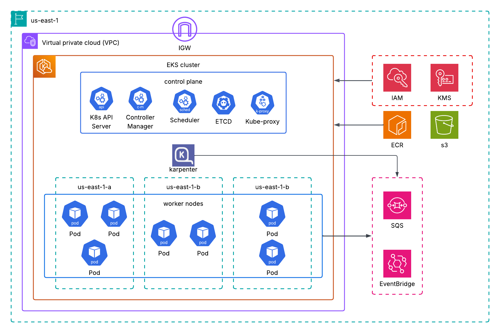

# Kubernetes Auto-Scaling at Warp Speed 🚀

**Cost-Optimized Workloads with AWS EKS & Karpenter**

This project showcases how to run **ultra cost-efficient Kubernetes workloads** on AWS EKS using **Karpenter** for intelligent node scaling. The entire setup is managed with **Terraform**, deployed via **GitHub Actions CI**, and continuously delivered with **Argo CD GitOps**.

👉 Full blog post: [Kubernetes Auto-Scaling at Warp Speed: Cost-Optimized with AWS EKS & Karpenter](https://medium.com/@jamiekariuki18/kubernetes-auto-scaling-at-warp-speed-cost-optimized-with-aws-eks-karpenter-9154f984c5bc)

---

## 🏗️ Architecture



---

## ⚡ Features

* Automated **EKS cluster** provisioning with Terraform
* **Karpenter** for near-instant Kubernetes node scaling
* **GitHub Actions CI** pipeline for building & pushing images
* **Argo CD** GitOps for continuous deployment of workloads
* **Infrastructure-as-Code (IaC)** for everything — including Argo CD itself

---

## 🚀 Getting Started

### 1️⃣ Clone the repository

```bash
git clone https://github.com/jamiekariuki/Kubernetes-Auto-Scaling-at-Warp-Speed-Cost-Optimized-with-EKS-Karpenter.git
cd Kubernetes-Auto-Scaling-at-Warp-Speed-Cost-Optimized-with-EKS-Karpenter
```

---

### 2️⃣ Provision Infrastructure

We split infra into **two Terraform layers**:

* **`infrastructure/statebucket/`** → Creates S3 backend + DynamoDB for Terraform state
* **`infrastructure/terraform/`** → Provisions VPC, IAM, EKS, and Karpenter

#### Step A: Setup Terraform Backend

```bash
cd infrastructure/statebucket
terraform init
terraform apply -auto-approve
```

#### Step B: Provision EKS & Karpenter

```bash
cd ../terraform
terraform init
terraform apply -auto-approve
```

This creates:

* AWS VPC & subnets
* EKS Cluster
* Karpenter Controller + NodeClass
* IAM roles & policies
* Argo CD

Once applied, Argo CD is ready and syncing apps from GitHub.

---

### 4️⃣ CI/CD Workflow

* **CI (GitHub Actions):**
  Triggered on each push to `main`.

  * Builds & pushes Docker images
  * Updates Kubernetes manifests in repo

* **CD (Argo CD):**
  Automatically syncs manifests from repo → deploys to EKS.

---

### 🔄 Updating Infrastructure

If you change Terraform configs:

```bash
cd infrastructure/terraform
terraform plan
terraform apply
```

Application updates (code changes) do **not** require manual action — CI/CD handles them.

---

## 📚 Reference

* Blog post: [Medium Article](https://medium.com/@jamiekariuki18/kubernetes-auto-scaling-at-warp-speed-cost-optimized-with-aws-eks-karpenter-9154f984c5bc)

